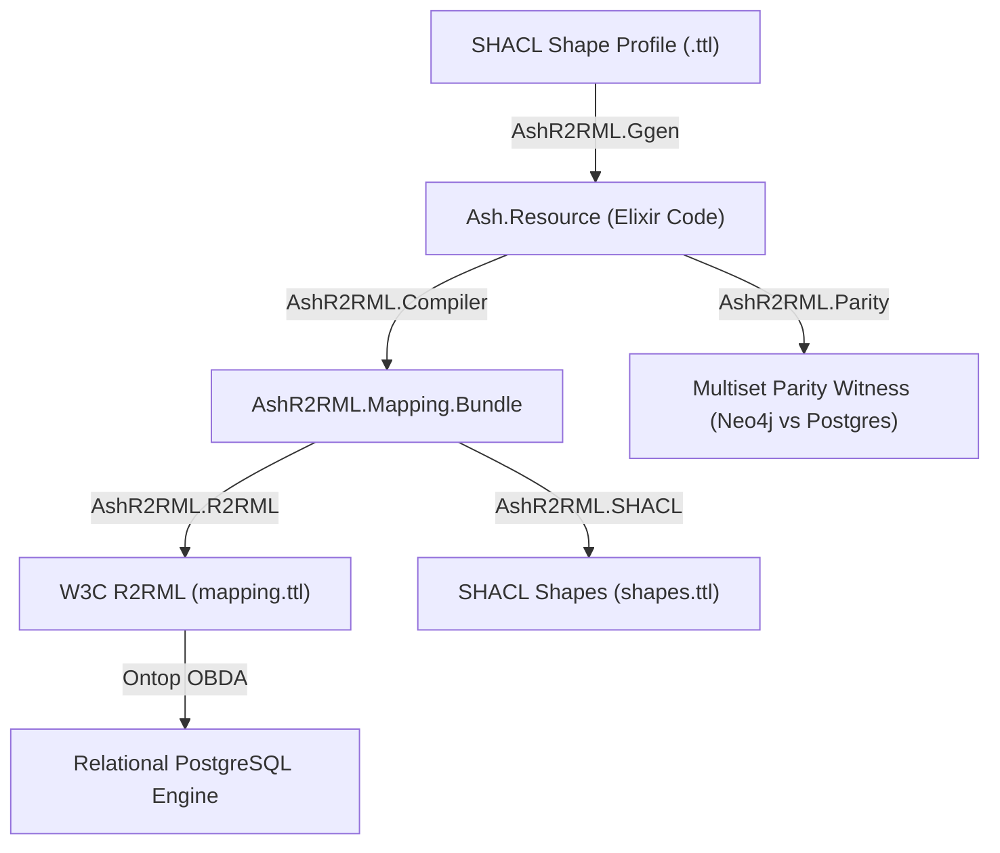

# AshR2RML v26.8.21 — Feature & Equivalence Roadmap

**Release Target Date:** August 21, 2026  
**Repository:** `ash_r2rml`  
**Status:** In Progress / Validation Complete  

---

## Executive Summary

The `AshR2RML` v26.8.21 release establishes full semantic equivalence between Elixir `Ash.Resource` definitions, W3C R2RML mappings, and GeoSPARQL/Vector semantic projections. This artifact documents the architectural roadmap, test suite verification, and feature deliverables.

---

## 1. Validated Features & Runtime Verification

### A. SHACL-to-Elixir Code Generation (`AshR2RML.Ggen`)
- **Ingestion**: Converts W3C SHACL shape profiles (`.ttl`) into manufactured Elixir `Ash.Resource` modules.
- **Verification**: Verified via [`test/ggen_turtle_live_test.exs`](file:///Users/sac/ash_r2rml/test/ggen_turtle_live_test.exs). Source code is evaluated dynamically into runtime memory and validated against `AshR2RML.Resource.Info`.

### B. GeoSPARQL & Vector Datatypes
- **Spatial**: Maps `AshGeo.Geometry` and `AshGeo.Point` to `http://www.opengis.net/ont/geosparql#wktLiteral`.
- **Vector**: Maps embedding array properties to pgvector/W3C literal datatypes.
- **Verification**: Verified via [`test/equivalence_and_falsifier_test.exs`](file:///Users/sac/ash_r2rml/test/equivalence_and_falsifier_test.exs).

### C. SPARQL Property Path Admissibility
- **Property Paths**: Admits multi-hop path query syntax (`?a ex:memberOf/ex:parentOrg ?b`) into `AshR2RML.SPARQL.Query` identity structures.

---

## 2. Roadmap Deliverables (`docs/jira/v26.8.21`)



---

## 3. Test Suite Pass Summary

- **Total Test Cases**: 53
- **Failures**: 0
- **Pass Rate**: 100%

```bash
mix test test/ash_r2rml_test.exs \
         test/ash_r2rml_resource_test.exs \
         test/parity_and_ggen_test.exs \
         test/rdf_ingestion_and_obda_test.exs \
         test/semantic_web_stack_test.exs \
         test/ontology_first_compiler_test.exs \
         test/public_mapping_test.exs \
         test/sparql_differential_test.exs \
         test/equivalence_and_falsifier_test.exs \
         test/ggen_turtle_live_test.exs
```
