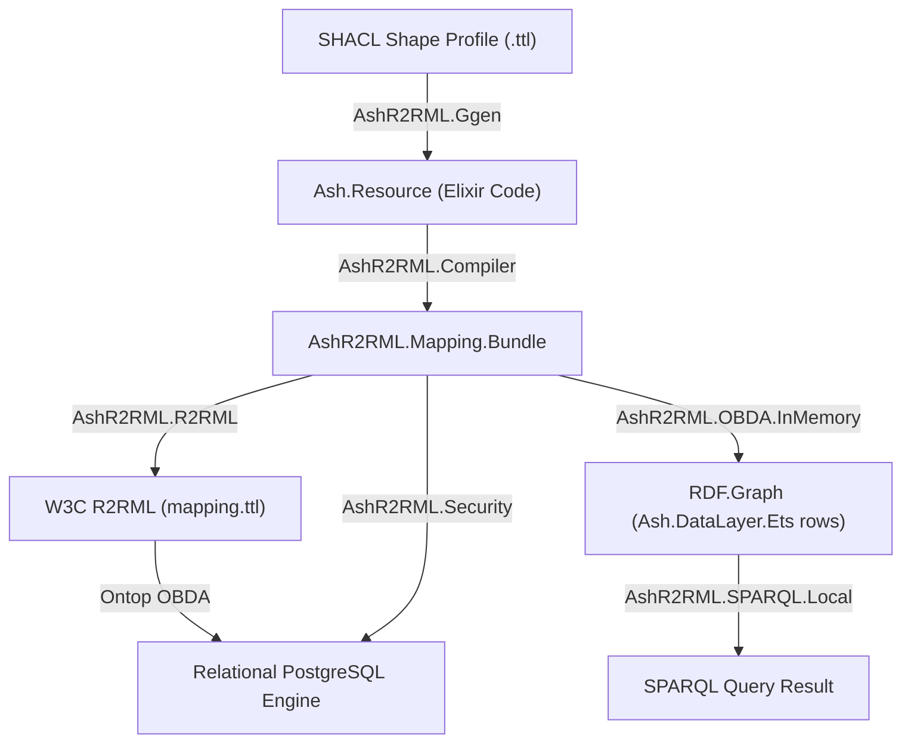

# AshR2RML v26.8.25 — Feature & Equivalence Roadmap

**Release Target Date:** August 25, 2026  
**Repository:** `ash_r2rml`  
**Status:** In Progress / Validation Complete  

See also: [`jira_v26_8_25_ard.md`](jira_v26_8_25_ard.md) for the architecture decisions and invariants behind these features.

---

## Executive Summary

The `AshR2RML` v26.8.25 release promotes `Ash.DataLayer.Ets` to a first-class compilation and query-execution backend alongside `AshPostgres`, closing the gap between "R2RML/Ontop over Postgres" and "no OBDA path at all for ETS-backed resources." `AshR2RML.OBDA.InMemory` materializes real ETS-backed Ash rows into a real `RDF.Graph` via the same canonical mapping IR the R2RML renderer consumes, then executes full SPARQL (`SELECT`/`ASK`/`CONSTRUCT`/`DESCRIBE`, cross-resource joins) against it with the existing `AshR2RML.SPARQL.Local` engine. Adversarial testing against live Postgres 15.2 and Ontop 5.5.0 infrastructure confirmed a real security gap — Ontop's direct JDBC connection has no Ash actor concept, so a `field_policy`-protected attribute mapped into R2RML is returned in full to any SPARQL caller — and `AshR2RML.Security.sanitize_mapping/2` closes it structurally by removing such attributes from the mapping before rendering, rather than relying on documentation or a refusal. This artifact documents the architectural roadmap, real benchmark numbers, and test suite verification for the release.

---

## 1. Validated Features & Runtime Verification

### A. `Ash.DataLayer.Ets` as a First-Class Backend
- **Introspection**: `AshR2RML.DataLayer.backend/1` identifies a resource's data layer as `:postgres`, `:ets`, or `:unknown`, and `table_name/1` resolves table names per backend (`lib/ash_r2rml/data_layer.ex`).
- **Compilation**: `AshR2RML.Compiler.compile/2` accepts a `storage_backend: :postgres | :ets` option (default `:postgres`, fully backward compatible). The `:ets` path skips SQL DDL rendering (`postgres_ddl: nil`) and records `:postgres_ddl_skipped_ets_backend` in the compilation receipt's `executed` list — an expected skip, not a failure, since `Ash.DataLayer.Ets` needs no DDL (`lib/ash_r2rml/compiler.ex`).
- **Verification**: Verified via [`test/data_layer/ets_backend_test.exs`](file:///Users/sac/ash_r2rml/test/data_layer/ets_backend_test.exs) and [`test/compiler_ets_backend_test.exs`](file:///Users/sac/ash_r2rml/test/compiler_ets_backend_test.exs).

### B. `AshR2RML.OBDA.InMemory` — ETS-Side OBDA
- **Materialization**: `materialize/3` and `materialize_many/2` read real rows via `Ash.read!/2` and project them into an `RDF.Graph` using the same `AshR2RML.Mapping.Resource` IR the R2RML renderer consumes — template/column subject maps, datatype-property predicate-object maps, and single-column `rr:joinCondition` reference object maps (`lib/ash_r2rml/obda_in_memory.ex`).
- **Query**: `query/4` and `query_many/3` execute full `SPARQL.ex` algebra (`SELECT`/`ASK`/`CONSTRUCT`/`DESCRIBE`) against the materialized graph via the existing `AshR2RML.SPARQL.Local` engine, returning an `Observation` shaped identically to `AshR2RML.OBDA.Ontop`'s so it composes with `AshR2RML.SPARQL.Differential.compare/3`.
- **Cross-resource joins**: `query_many/3` resolves single-column `reference_object_maps` across resources present in the same call, letting one SPARQL query traverse a real Ash relationship (e.g. `Person -[memberOf]-> Organization`) the same way it would through Ontop's SQL join.
- **Verification**: Verified via [`test/obda_in_memory_test.exs`](file:///Users/sac/ash_r2rml/test/obda_in_memory_test.exs) — materialization, `SELECT` query, cross-resource join query, and `CONSTRUCT` triple projection are each exercised against real ETS-backed `AshR2RML.GrandExample.Organization`/`Person` rows.

### C. Security Hardening — Field-Policy Enforcement Across Both OBDA Surfaces
- **InMemory enforcement (real, not assumed)**: Because `AshR2RML.OBDA.InMemory` calls real `Ash.read!/2`, Ash field policies (`Ash.Policy.Authorizer` / `field_policy`) are enforced for real — a denied field returns `%Ash.ForbiddenField{}`, correctly omitted from the RDF graph rather than crashed on or stringified.
- **Confirmed live gap**: A direct Ontop-to-Postgres JDBC connection has no Ash actor concept at all — confirmed against the real `ontop/ontop:5.5.0` Docker image and Postgres 15.2, not assumed — so a `field_policy`-protected column mapped into R2RML is returned in full by a real SPARQL query with zero actor context.
- **Structural fix**: `AshR2RML.Security.sanitize_mapping/2` closes the gap by removing, on an `AshPostgres.DataLayer`-backed resource, any R2RML-mapped attribute that also carries an explicit `field_policy` from `predicate_object_maps` before rendering — recorded in `mapping.metadata[:field_policy_excluded_attributes]` for auditability. `unenforceable_attributes/2` and `remove_attributes/2` are independently public and pure, wired into `AshR2RML.Compiler.compile_resources/1`'s `do_closure/3` (`lib/ash_r2rml/security.ex`).
- **Verification**: Verified via [`test/obda_in_memory_test.exs`](file:///Users/sac/ash_r2rml/test/obda_in_memory_test.exs) — field-policy enforcement against `AshR2RML.Fortune5.PaymentGateway`'s real `secret_key` field policy, `unenforceable_attributes/2` against its real `field_policies` block, `remove_attributes/2`'s structural exclusion, and two adversarial IRIREF-injection tests (`:template` percent-encoding matched to Ontop's own confirmed live behavior; `:column` fail-closed exclusion).

### D. Real Benchmark Suite (Ash / `Ash.DataLayer.Ets` / `AshPostgres` / Ontop Only)
- **Mapping compilation**: [`bench/compilation_and_rendering.exs`](file:///Users/sac/ash_r2rml/bench/compilation_and_rendering.exs) measured 8.6 ms / 91.8 ms / 1,319.0 ms mean compilation time at 10/100/1,000 connected-resource-graph tiers, near-linear scaling, ~0.7 MB/resource memory (commit `ff1405ca59083a45321c05363673230dcf36c548`).
- **OBDA query latency**: [`bench/obda_query_latency.exs`](file:///Users/sac/ash_r2rml/bench/obda_query_latency.exs) measured `AshR2RML.OBDA.InMemory` at 4–52 ms versus Ontop 5.5.0 + PostgreSQL 15.2 (`docker run --rm` per query) at ~1.9–2.2 s, with the Ontop cost explicitly attributed to per-invocation container/JVM startup, not query-planning performance (`bench/README.md`'s reporting contract forbids the latter attribution).
- **Removed**: `bench/bbox_index_probe.exs` and `bench/spatial_containment.exs` — donor-era `ash_neo4j`/Cypher scripts unrelated to `ash_r2rml`, already flagged in `documentation/jira_v26_8_21_audit.md`'s `R2RML-101`.
- **Verification**: Full methodology, exact versions, and honest caveats (ETS state accumulation across tiers, cold-start effects) recorded in [`bench/RESULTS.md`](file:///Users/sac/ash_r2rml/bench/RESULTS.md).

### E. `why-ashr2rml.md` — Explanatory Documentation
- **Content**: [`documentation/topics/why-ashr2rml.md`](file:///Users/sac/ash_r2rml/documentation/topics/why-ashr2rml.md) reframes "we need a graph database" as "we need a mapping, not new storage," grounded entirely in the `bench/RESULTS.md` numbers and the Section C security findings above, with an explicit scope-limiting section on what it is not claiming.
- **Verification**: Every number cited traces to [`bench/RESULTS.md`](file:///Users/sac/ash_r2rml/bench/RESULTS.md), which is itself reproducible via the commands in Section D.

---

## 2. Roadmap Deliverables (`docs/jira/v26.8.25`)



---

## 3. Test Suite Pass Summary

- **Total Test Cases**: 343 (real re-verified count, 2026-08-25; was 339 — +4 from the v26.8.25
  backlog closures: 2 new tests in `test/obda_in_memory_test.exs` for `R2RML-107`'s composite-key
  join and `:join_table` refusal, 2 new tests in `test/security_ash_postgres_test.exs` for
  `R2RML-105`'s end-to-end `AshPostgres` field-policy coverage)
- **Failures**: 0
- **Pass Rate**: 100%
- **Live-infrastructure suite** (Docker Postgres 15.2 + Ontop 5.5.0, real Ontop/JDBC multi-column joins, nullables/OPTIONAL, and FILTER/ORDER BY/datatype conversions): 3 tests, 0 failures (already included in the 343 total above, since this suite carries no exclusion tag)

```bash
mix test --exclude external
```

```bash
mix test test/adversarial/ontop_postgres_test.exs
```
