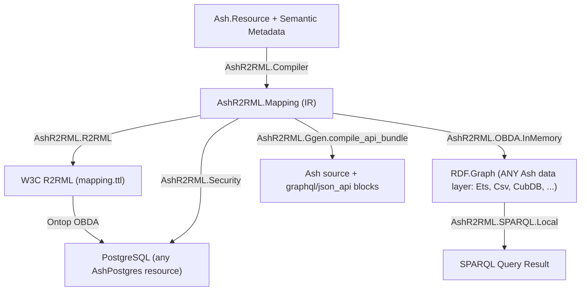

# AshR2RML v26.8.26 — Feature & Equivalence Roadmap

**Release Target Date:** August 26, 2026
**Repository:** `ash_r2rml`
**Status:** In Progress / Validation Complete

See also: [`jira_v26_8_26_ard.md`](jira_v26_8_26_ard.md) for the architecture decisions,
5-agent research findings, and open tickets behind these features.

---

## Executive Summary

v26.8.26 extends v26.8.25's field-policy security work in two directions and closes out the
open questions from the "other Ash extensions" research pass with 5 real, sourced
investigations rather than speculation. Shipped: (1) confirmation, via real tests against real
`AshCsv.DataLayer` and `AshCubDB.DataLayer` resources, that `AshR2RML.OBDA.InMemory` already
works against any Ash data layer, not just `Ash.DataLayer.Ets` as its prior moduledoc implied;
(2) `AshR2RML.Ggen.compile_api_bundle/2`, auto-deriving minimal, verified-compilable
`graphql do ... end`/`json_api do ... end` blocks from the same mapping IR that already drives
`r2rml`, with `ash_graphql`/`ash_json_api` added strictly as `:test`-only dependencies. Ticketed
for follow-on work: a newly-discovered HIGH-severity security gap (`ash_cloak` field-level
encryption can leak plaintext through `AshR2RML.OBDA.InMemory` under a common, documented
configuration) and a confirmed `ash_archival` soft-delete asymmetry between the two OBDA
surfaces, both the same class of finding as v26.8.25's field-policy gap.

---

## 1. Validated Features & Runtime Verification

### A. `AshR2RML.OBDA.InMemory` Confirmed Data-Layer-Agnostic (Not Just ETS)
- **Finding**: `materialize/3`'s `rows_for/3` has no data-layer gate at all -- it calls
  `Ash.read!/2` unconditionally. This was true before v26.8.26 but undocumented and unverified
  beyond `Ash.DataLayer.Ets`.
- **Verification**: [`test/obda_in_memory_other_data_layers_test.exs`](file:///Users/sac/ash_r2rml/test/obda_in_memory_other_data_layers_test.exs)
  materializes and SPARQL-queries real rows from a real `AshCsv.DataLayer` resource (an actual
  CSV file on disk) and a real `AshCubDB.DataLayer` resource (an actual CubDB store on disk) --
  zero code changes required for either to work. `AshR2RML.DataLayer.backend/1` correctly
  classifies both as `:unknown` (it only names `:postgres`/`:ets`), which does not block
  materialization since `InMemory` never consults it.
- **Fix**: `lib/ash_r2rml/obda_in_memory.ex`'s moduledoc corrected -- it previously called
  itself the "ETS-side OBDA counterpart," which undersold its real generality.

### B. `AshR2RML.Ggen.compile_api_bundle/2` — Auto-Derived GraphQL/JSON:API Blocks
- **Clarification, not a new dependency**: any consumer resource can already add
  `AshGraphql.Resource`/`AshJsonApi.Resource` directly today, independent of AshR2RML, because
  Ash extensions compose. This feature only auto-derives the minimal starting block from the
  same mapping IR (`resource.module` → type name) so a resource author doesn't invent it by
  hand.
- **Implementation**: `AshR2RML.Semantic.Ash.render/2` (new `opts` param, default `[]`,
  byte-identical output to `render/1` when unset) and `AshR2RML.Ggen.compile_api_bundle/2`
  (`lib/ash_r2rml/ggen.ex`), additive alongside `compile_bundle/1`.
- **Dependencies**: `ash_graphql`/`ash_json_api` added as `:test`-only (`mix.exs`) -- used
  solely to verify the emitted source compiles as real Ash DSL; AshR2RML's own runtime carries
  no GraphQL/JSON:API dependency.
- **Verification**: [`test/ggen_api_bundle_test.exs`](file:///Users/sac/ash_r2rml/test/ggen_api_bundle_test.exs)
  actually `Code.eval_string/1`s the generated source (same pattern as
  `test/ggen_turtle_live_test.exs`) and confirms via real `Spark.extensions/1`,
  `AshGraphql.Resource.Info.type/1`, `AshJsonApi.Resource.Info.type/1` that the derived
  extensions/types are genuinely valid, not just plausible-looking text.

### C. Five-Agent Research Pass on the Ash Extension Ecosystem (real, sourced, adversarially scoped)
Dispatched via the `Explore` subagent type, one question each, all findings cross-checked
against real Hex/GitHub sources and this repo's own code:
1. **`ash_paper_trail` → PROV-O**: real, well-scoped, medium-effort feature (field-by-field
   mapping table produced; see ARD). Not yet implemented.
2. **`ash_archival` soft-delete asymmetry**: **confirmed real gap**, same class as the
   field-policy issue. `Ash.read!/2` (used by `InMemory`) correctly excludes archived rows via
   Ash's own query preparation; a direct Ontop/JDBC query against the raw Postgres table does
   not, since the exclusion is Ash-application-layer only with no Postgres-side enforcement.
   Ticketed, not yet fixed.
3. **`ash_events` vs. `AshR2RML.Telemetry.OCEL2`**: nuanced verdict -- partial Eliminate
   opportunity for the hand-rolled NDJSON capture/storage plumbing
   (`AshR2RML.Telemetry.OcelAshEmitter`), but OCEL2's multi-object (E2O/O2O) and process-mining
   (conformance-checking) capabilities are genuinely differentiated and should be kept
   regardless. Not yet implemented -- design decision, not a mechanical change.
4. **`ash_cloak` field-level encryption — HIGH SEVERITY, newly discovered**: unlike the
   field-policy gap (Ontop over-exposes, InMemory is safe), this risk runs the *opposite*
   direction. `ash_cloak` decryption is a lazy Ash calculation; when a resource sets
   `decrypt_by_default` (a normal, documented, commonly-reached-for option) on a cloaked
   attribute, `AshR2RML.OBDA.InMemory`'s plain `Ash.read!/2` silently loads and materializes the
   **decrypted plaintext** into the RDF graph. Ontop, by contrast, can only ever see the raw
   `encrypted_<name>` ciphertext column -- safe by architectural accident, not by design.
   **Ticketed as the highest-priority item for v26.8.27** (see ARD R2RML-109).
5. **Prior art search**: no public prior art combining Ash/Reactor/Spark with R2RML/RDF/SPARQL/
   SHACL was found; `ash_r2rml` appears first-of-kind in this specific combination. Closest
   adjacent prior art: **Grax** (`rdf-elixir/grax`), an Ecto-schema-like RDF graph data mapper --
   a data-mapper, not an Ash-style auto-deriving resource/API framework. Informational; no
   action item.

---

## 2. Roadmap Deliverables (`docs/jira/v26.8.26`)



---

## 3. Test Suite Pass Summary

- **Total Test Cases**: 354
- **Failures**: 0
- **Pass Rate**: 100%
- New this release: 4 tests (`test/obda_in_memory_other_data_layers_test.exs`) + 4 tests
  (`test/ggen_api_bundle_test.exs`), on top of v26.8.25's 346.

```bash
mix test --exclude external
```

```bash
mix test test/obda_in_memory_other_data_layers_test.exs test/ggen_api_bundle_test.exs
```
